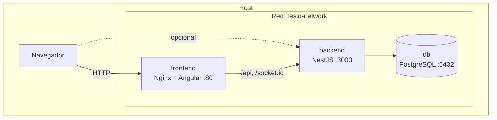

# TesloShop — Contenerización con Docker y Docker Compose

Aplicación **end-to-end**: **Angular 19** (frontend), **NestJS** (API) y **PostgreSQL 14.3** (base de datos), orquestada con Docker Compose.

## Arquitectura



- El **navegador** accede al frontend en el puerto publicado (por defecto `80`). Nginx hace de **proxy inverso** hacia `backend:3000` para `/api` y `/socket.io`, evitando problemas de CORS en uso normal.
- Dentro de Compose, los servicios se resuelven por **nombre** (`db`, `backend`, `frontend`), no por `localhost`.
- El backend usa `DB_HOST=db` (nombre del servicio PostgreSQL).

Orden de arranque: **db** (con `healthcheck` hasta que Postgres acepte conexiones) → **backend** (`depends_on: service_healthy`) → **frontend** (`depends_on: backend`).

## Estructura del repositorio

| Ruta | Descripción |
| --- | --- |
| `docker-compose.yml` | Servicios `db`, `backend`, `frontend`, red y volumen de datos |
| `.env.example` | Plantilla de variables; copiar a `.env` |
| `start.sh` / `stop.sh` | Arranque y parada con `docker compose` |
| `teslo-shop/` | Backend NestJS y `Dockerfile` (etapas `dev` y `prod`) |
| `angular-tesloshop/` | Frontend Angular, `Dockerfile` (build + Nginx) y `nginx.conf` |

## Requisitos

- Docker Engine y Docker Compose v2 (`docker compose`).
- Puertos libres según `.env` (por defecto `80`, `3000`, `5432`).

## Pasos de ejecución

1. **Variables de entorno**

   ```bash
   cp .env.example .env
   ```

   Edita `.env` y unifica al menos: `POSTGRES_PASSWORD`, `DB_PASSWORD` (mismo valor) y `JWT_SECRET`.

2. **Permisos de los scripts** (Linux/macOS)

   ```bash
   chmod +x start.sh stop.sh
   ```

3. **Levantar el stack**

   ```bash
   ./start.sh
   ```

   O directamente:

   ```bash
   docker compose up --build -d
   ```

4. **Poblar datos de prueba** (primera vez)

   - Navegador: `http://localhost:3000/api/seed` (ajusta el host/puerto si cambiaste `BACKEND_PUBLISH_PORT`).
   - O: `curl http://localhost:3000/api/seed`

5. **Probar la aplicación**

   | Recurso | URL típica |
   | --- | --- |
   | Frontend | `http://localhost` (o el puerto de `FRONTEND_PUBLISH_PORT`) |
   | API | `http://localhost:3000/api` |
   | Swagger | Documentación expuesta bajo el prefijo global `api` del backend |

6. **Ver logs**

   ```bash
   docker compose logs -f
   docker compose logs -f backend
   ```

7. **Detener**

   ```bash
   ./stop.sh
   ```

   Datos de Postgres se conservan en el volumen `postgres-data`. Para borrar también la base:

   ```bash
   docker compose down -v
   ```

## Servicios en `docker-compose.yml`

| Servicio | Imagen / build | Rol |
| --- | --- | --- |
| **db** | `postgres:14.3` | Base de datos; volumen persistente; `healthcheck` con `pg_isready` |
| **backend** | `./teslo-shop` (etapa `${STAGE}`) | API NestJS; en `dev` se monta el código y un volumen anónimo en `/app/node_modules` |
| **frontend** | `./angular-tesloshop` | Nginx sirve el build estático y proxifica `/api` y `/socket.io` |

## Build manual de imágenes (práctica)

Desde la raíz del repo:

```bash
docker build -t teslo-backend ./teslo-shop --target dev
docker build -t teslo-frontend ./angular-tesloshop
```

## Evidencias (entrega — capturas tuyas)

El repositorio incluye la **configuración y la guía**; las **evidencias en imagen** las debes **generar tú** al validar el sistema en tu equipo (Docker no puede ejecutarse desde este entorno de desarrollo).

Checklist alineado con la práctica (Fases 2–4):

| # | Qué demuestra | Cómo obtenerla |
| --- | --- | --- |
| 1 | Imágenes construidas (Fase 2) | Terminal tras `docker build ...` o salida de `docker compose build` sin error |
| 2 | Orquestación activa (Fase 3) | `docker compose ps`: tres servicios **Up**; **db** en estado **healthy** |
| 3 | Comunicación FE ↔ API | Navegador en `http://localhost` (o tu `FRONTEND_PUBLISH_PORT`) con la tienda cargada |
| 4 | API y datos de prueba | Captura de `http://localhost:3000/api/seed` mostrando `"SEED EXECUTED"` o salida de `curl` equivalente |
| 5 | (Opcional) API / Swagger | Pantalla de la documentación Swagger del backend si la usas para probar endpoints |

Guarda las capturas en una carpeta que indique tu institución (por ejemplo `evidencias/` o el anexo del informe) y súbelas con el informe o el repositorio si tu docente lo pide.

### Capturas de evidencia

Pega aquí las capturas correspondientes (reemplaza los archivos por los que generes en tu equipo):

#### 1. Imágenes construidas (Fase 2)


#### 2. Orquestación activa (Fase 3)


#### 3. Comunicación FE ↔ API (Frontend cargado)


#### 4. API y datos de prueba (Seed ejecutado)


#### 5. Swagger (opcional)


## Resolución de problemas breve

- **Backend reiniciando**: revisar credenciales `DB_*` vs `POSTGRES_*` y logs `docker compose logs backend`.
- **Puerto en uso**: cambiar `FRONTEND_PUBLISH_PORT`, `BACKEND_PUBLISH_PORT` o `POSTGRES_PUBLISH_PORT` en `.env` y `docker compose down` + `docker compose up -d`.
- **`docker-compose` vs `docker compose`**: en sistemas recientes usa `docker compose` (plugin). Los scripts intentan ambos.

---

GFPI-F-135 V04 — Laboratorio práctica final: contenerización end-to-end.
