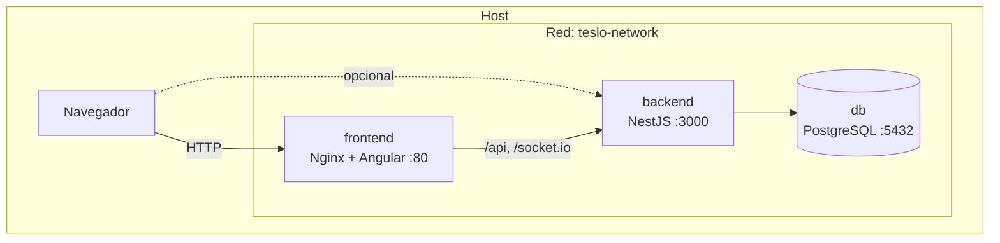

# TesloShop — Contenerización con Docker y Docker Compose

Aplicación **end-to-end**: **Angular 19** (frontend), **NestJS** (API) y **PostgreSQL 14.3** (base de datos), orquestada con Docker Compose.

## Arquitectura



- El **navegador** accede al frontend en el puerto publicado (por defecto `80`). Nginx hace de **proxy inverso** hacia `backend:3000` para `/api` y `/socket.io`, evitando problemas de CORS en uso normal.
- Dentro de Compose, los servicios se resuelven por **nombre** (`db`, `backend`, `frontend`), no por `localhost`.
- El backend usa `DB_HOST=db` (nombre del servicio PostgreSQL).

Orden de arranque: **db** (con `healthcheck` hasta que Postgres acepte conexiones) → **backend** (`depends_on: service_healthy`) → **frontend** (`depends_on: backend`).

## Estructura del repositorio

| Ruta | Descripción |
| --- | --- |
| `docker-compose.yml` | Servicios `db`, `backend`, `frontend`, red y volumen de datos |
| `.env.example` | Plantilla de variables; copiar a `.env` |
| `start.sh` / `stop.sh` | Arranque y parada con `docker compose` |
| `teslo-shop/` | Backend NestJS y `Dockerfile` (etapas `dev` y `prod`) |
| `angular-tesloshop/` | Frontend Angular, `Dockerfile` (build + Nginx) y `nginx.conf` |

## Requisitos

- Docker Engine y Docker Compose v2 (`docker compose`).
- Puertos libres según `.env` (por defecto `80`, `3000`, `5432`).

## Pasos de ejecución

1. **Variables de entorno**

   ```bash
   cp .env.example .env
   ```
   


   Edita `.env` y unifica al menos: `POSTGRES_PASSWORD`, `DB_PASSWORD` (mismo valor) y `JWT_SECRET`.

1. **Permisos de los scripts** (Linux/macOS)

   ```bash
   chmod +x start.sh stop.sh
   ```
   

   


2. **Levantar el stack**

   ```bash
   ./start.sh
   ```
      
   

   O directamente:

   ```bash
   docker compose up --build -d
   ```
   


3. **Poblar datos de prueba** (primera vez)

   - Navegador: `http://localhost:3000/api/seed` (ajusta el host/puerto si cambiaste `BACKEND_PUBLISH_PORT`).
   - O: `curl http://localhost:3000/api/seed`
   - 


4. **Probar la aplicación**

   | Recurso | URL típica |
   | --- | --- |
   | Frontend | `http://localhost` (o el puerto de `FRONTEND_PUBLISH_PORT`) |
   | API | `http://localhost:3000/api` |
   | Swagger | Documentación expuesta bajo el prefijo global `api` del backend |

   

   


6. **Ver logs**

   ```bash
   docker compose logs -f
   

   docker compose logs -f backend
   ```
   


7. **Detener**

   ```bash
   ./stop.sh
   ```
    

   Datos de Postgres se conservan en el volumen `postgres-data`. Para borrar también la base:

   ```bash
   docker compose down -v
   ```
   


## Servicios en `docker-compose.yml`

| Servicio | Imagen / build | Rol |
| --- | --- | --- |
| **db** | `postgres:14.3` | Base de datos; volumen persistente; `healthcheck` con `pg_isready` |
| **backend** | `./teslo-shop` (etapa `${STAGE}`) | API NestJS; en `dev` se monta el código y un volumen anónimo en `/app/node_modules` |
| **frontend** | `./angular-tesloshop` | Nginx sirve el build estático y proxifica `/api` y `/socket.io` |


GFPI-F-135 V04 — Laboratorio práctica final: contenerización end-to-end.
